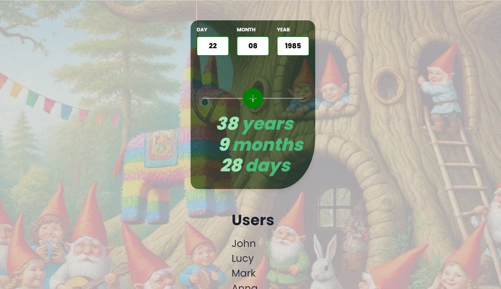

# Frontend Mentor - Expenses chart component

## Welcome! 👋

Thanks for checking out this front-end coding challenge.

[Frontend Mentor](https://www.frontendmentor.io) challenges help you improve your coding skills by building realistic projects.

**To do this challenge, you need a decent understanding of HTML, CSS and JavaScript.**

## The challenge

# Frontend Mentor - Expenses chart component solution

This is a solution to the [Expenses chart component challenge on Frontend Mentor](https://www.frontendmentor.io/challenges/expenses-chart-component-e7yJBUdjwt). Frontend Mentor challenges help you improve your coding skills by building realistic projects.

## Table of contents

## Table of contents

- [Overview](#overview)
- [Screenshot](#screenshot)
- [Links](#links)
- [My process](#my-process)
- [Built with](#built-with)
- [What I learned](#what-i-learned)
- [Continued development](#continued-development)
- [Useful resources](#useful-resources)
- [Author](#author)
- [Acknowledgments](#acknowledgments)

**Note: Delete this note and update the table of contents based on what sections you keep.**

## Overview

### Screenshot

### Links

- Solution URL: (https://github.com/Junbol-Frontend-Mentor/news-homepage)
- Live Site URL: (https://junbol-frontend-mentor.github.io/news-homepage/)

## My process

### 🛠 Built with

- Semantic HTML5 markup 🧾
- Sass(SCSS) Flexbox 🎨
- BEM (Block.Element.Modifier)🧾
- Mobile-first workflow 📱
- GIT/GitHub 🧾🌎
- PowerShell (CLI) 🧾
- Javascript 🤖🚀

### What I learned

oh boy where should start. As it obvious I took the liberty to change a bit the design just for the fun. But then I decided to create first an an in Javascript en then transform it into a React app and that is where the issues start because I have change gears from Vanilla to React and from Sass to ChakraUI and that was a challenge but the real pain was when I went crazy and decided to create my first RESTFful API, yes with a database hosted in Heroku that went nuts.Because it took me 2 days to fix an issue with the server deployment. At the end I resolved but after so much twicking I don't know what was wrong, I would say deleting the node_modules and installing them again fix the issue or having the right settings in the package.json file did the trick. I dont really care, now I can have finally have my Piña Colada 🍹to celebrate this victory 🎊🎉

### Continued development

I would like to continue studying responsive SCSS specially with Grid + Flexbox and CSS animation, transitions and FX like parallax.

### Useful resources

- [web.dev](https://web.dev/learn/css) - This helped me for get back on track with CSS.
- [w3schools](https://www.w3schools.com/css/default.asp) - The one place to refresh stuff in practical way.

## Author

- Website - [Junier Bolivar](https://www.bolivarcreativedesign.com)
- Frontend Mentor - [Junbol](https://www.frontendmentor.io/profile/Junbol)
- Twitter - [@JunierBolivar](https://www.twitter.com/@JunierBolivar)

## Acknowledgments
